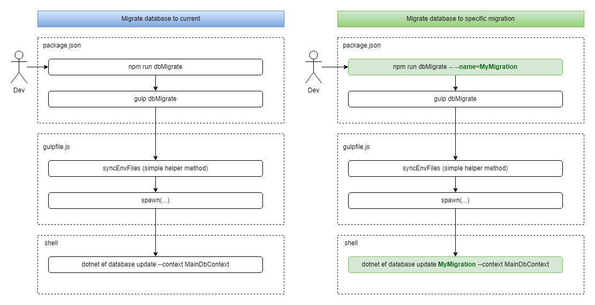
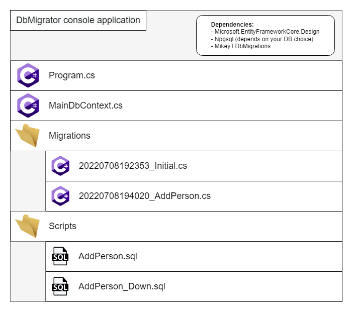
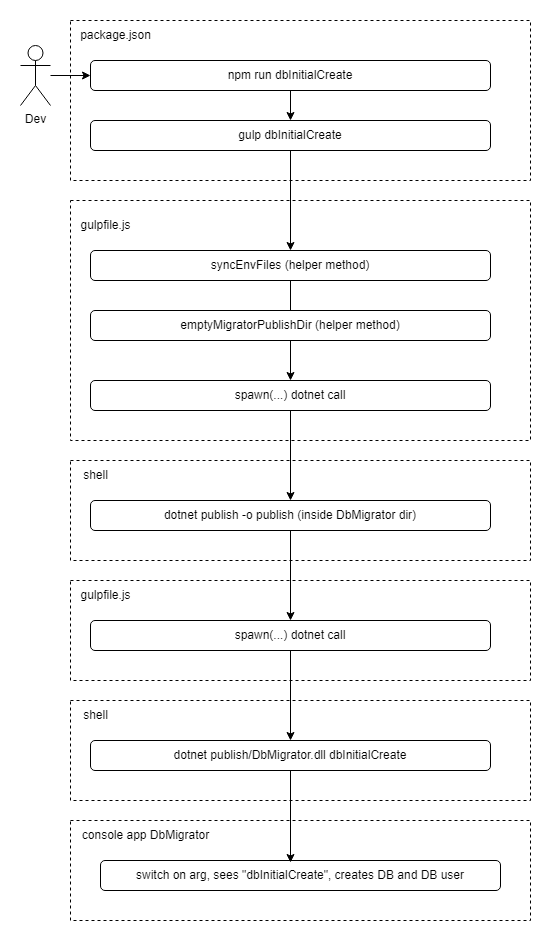
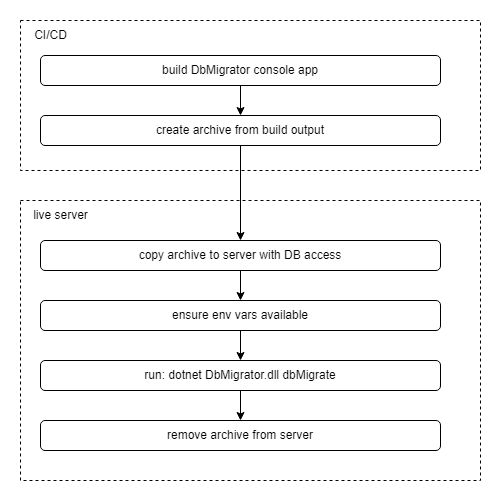

# db-migrations-dotnet

This is a NuGet package and sample solution that show how to manage DB migrations using plain SQL scripts and the built-in dotnet ef tool (Entity Framework) using some simple wrapper code to provide a connection string and give EF your script paths. All this without actually forcing you into using EF for your data access (we're only using it for the DB migrations themselves). An example project also shows how to use simple node package.json commands and gulp tasks to make the process even easier.

You could extend this concept into a small framework, or just copy and paste a few lines from this example into your own project. The point is that you can get DB migrations without being forced into using EF for data access and without using a heavy opinionated DB migrations framework.

## What do we need out of a DB migration tool?

At the most basic level, a DB migration framework should really just be responsible for keeping track of what scripts have run and provide simple commands to roll forward or back to a particular migration.

## Why create this project?

There are a number of full-featured DB migration frameworks and libraries out there. Some of them are great. Some of them cause more problems then they solve.

Here are some reasons you might not want a large and complex framework or library for DB migrations:

- Using a DB migration framework might add unnecessary complexity to your project
- Most DB migration frameworks are highly opinionated about how you treat DB management. The moment you need something they don't agree with, you're looking at a large effort to create a workaround, or you may end up ejecting from their solution completely, wasting valuable time.
- Bugs or missing features in an open source project might be difficult to get addressed in a reasonable amount of time
- Increased onboarding time for new developers on the project
- DB frameworks advertise that they've created the ability to manipulate SQL in your favorite non-SQL programming language. My experience is that the best language for SQL is usually... SQL. Using your favorite programming language to manipulate SQL seems cool, but might sometimes just be a novelty that costs more time than it saves.

The goal of this project is to demonstrate that we can get basic DB migration functionality without a third party framework. We can leverage some existing tools (dotnet ef) and the tried and tested plain SQL scripts that won't fail because of an intermediary translation layer failure.

## What is the shortest path to implementing this?

Most of the code in this project is just example stuff you may or may not need or want. At a minimum, you need:

- A project that includes references to:
  - Microsoft.EntityFrameworkCore
  - Microsoft.EntityFrameworkCore.Relational
  - Microsoft.EntityFrameworkCore.Design
- A DbContext class that you provide a DB connection string to
- A helper method that calls the `MigrationBuilder.Sql()` method that you can use in in the Up and Down methods that the dotnet ef tool generates

## What extra stuff is in this example project?

Most of the extra stuff in the example project falls in one of these categories:
- Gather up environment variables to be used to create a DB connection string
- Convenience console app script commands to create the initial DB or drop it on a developer machine
- Code to read in SQL files from a common location and process/replace any script placeholders
- Convenience scripts to build and package a console app that can be used to migrate DBs in non-dev environments

Most projects/teams are going to have specific requirements and preferences when it comes to environments, deployments and automation/scripting, so much of this extra example code may or my not be relevant to your particular situation. The key here is that you can take just the dotnet ef tool use and plain SQL scripts and use your team's other custom processes. Flexibility is the name of the game here.

## Common developer DB related tasks

Below are the wrapper package.json commands you would run if setting up your project like the included example-solution.

<table>
<thead>
<th>Task</th>
<th>Notes</th>
</thead>
<tbody>

<tr>
<td>List all DB migrations</td>
<td>
<code>npm run dbMigrationsList</code>
</td>
</tr>

<tr>
<td>Create new DB migration</td>
<td>
Steps:

- <code>npm run dbAddMigration -- --name=YourMigrationName</code>
- Create Up and Down SQL scripts in DbMigrator/Scripts dir
- Add calls to <code>MigrationScriptRunner.RunScript</code> in auto-generated Up and Down methods, referencing the SQL files you just created
- Run <code>npm run dbMigrate</code>
</td>
</tr>

<tr>
<td>Migrate DB to up to current</td>
<td>
<code>npm run dbMigrate</code>
</td>
</tr>

<tr>
<td>Migrate DB to a specific state</td>
<td>
If you run <code>npm run dbMigrationsList</code> and see something like this:

<pre>
20220708193900_Initial
20220708194020_AddPerson
20220708194020_AddMoreStuff
</pre>

then you can migrate to the state after AddPerson but before AddMoreStuff by running:

<code>npm run dbMigrate -- --name=AddPerson</code>

If you were at current this will run the <code>Down()</code> method for the AddMoreStuff DB migration. If you were at Initial, this would run the <code>Up()</code> method for the AddPerson DB migration. Note that you don't have to use the auto-generated timestamps when passing migration name as a parameter.
</td>
</tr>

<tr>
<td>Remove DB migration</td>
<td>
You wouldn't want to do this after having pushed code with a migration. If you've already pushed code and you want to remove the schema you created, you should create a new DB migration that drops the objects in question. You should never delete a migration once it has left your developer machine (someone else could have run the migration or CI/CD could have migrated shared DB).  
Steps:

- To find out the name of the migration before the one you want to remove, you could run <code>npm run dbMigrationsList</code>code> 
- If you're already run dbMigrate with the migration you want to remove, rollback using the name of the previous migration, run: <code>npm run dbMigrate -- --name=PreviousMigrationName</code> 
- Run <code>npm run dbRemoveMigration -- --name=YourMigration</code> 
- Delete SQL scripts you previously created in <code>Dbmigrator/Scripts</code>
</td>
</tr>

<tr>
<td>New project setup</td>
<td>
If using the CLI wrapper from the MikeyT.DbMigrations package, you can create the database and database user with:

<code>npm run dbInitialCreate</code>

After creating the database it's a good idea to create an empty initial DB migration:

- <code>npm run dbAddMigration -- --name=Initial</code> 
- <code>npm run dbMigrate</code>
</td>
</tr>

<tr>
<td>Misc</td>
<td>
If you're working on script automation for setting up the DB, you might want to repeatedly drop and recreate after making changes. These commands are useful for this scenario:

<code>npm run dbDropAll</code> 
<code>npm run dbDropAndRecreate</code>
</td>
</tr>

</tbody>
</table>

## Diagrams

Package.json and gulpfile example usage.

Sample console app to contain auto-generated c# scripts in addition to manually created corresponding sql scripts.

Sample usage of console app to run arbitrary custom work. In this case, creating the initial DB instance and DB user.

Abstract steps for deployment of DB changes. When the console app receives the `dbMigrate` command, it simply instantiates the DbContext object and runs `await dbContext.Database.MigrateAsync();`.

## Other docs

- [Example New Setup](./docs/ExampleNewSetup.md)

