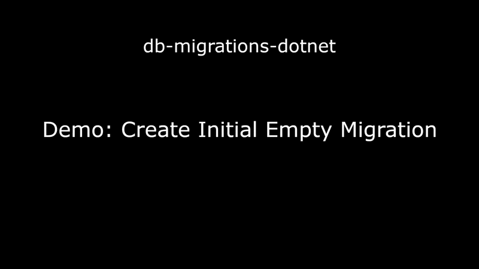
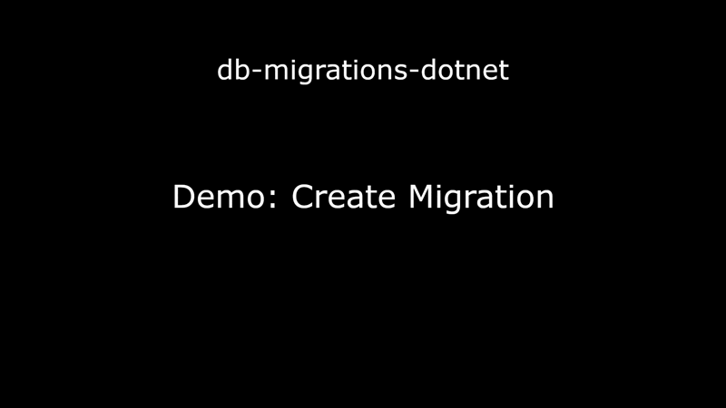
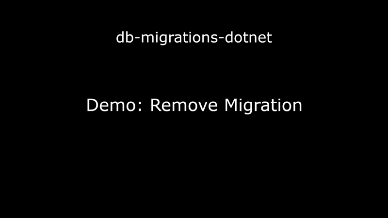

# db-migrations-dotnet Demo

## Project setup

The following clip demonstrates setting up a brand new project that will be utilizing a single PostgreSQL database:

- Create new directory for project
- Initialize [swig-cli](https://github.com/mikey-t/swig) dev task orchestration tool for project
- Verify swig is working
- Add `docker-compose.yml` file - PostgreSQL is used for this example
- Add `.env` file with credentials for DB access
- Update `swigfile.ts` to re-export methods for the DockerCompose module from the referenced npm package [swig-cli-modules](https://github.com/mikey-t/swig-cli-modules)
- Run new swig task `dockerUp` to start PostgreSQL docker container
- Use vscode PostgreSQL extension to connect to newly running database
- Update `swigfile.ts` to:
  - Re-export methods for the EntityFramework module from the referenced npm package [swig-cli-modules](https://github.com/mikey-t/swig-cli-modules)
  - Add config for the single local PostgreSQL database that this project will be managing
- Run newly available swig task `dbBootstrapMigrationsProject` which will generate a C# project
- Copy `.env` to the newly generated C# migrations project
- Run the swig task `dbSetup` which will create users and databases defined in our `swigfile.ts`
- Use vscode PostgreSQL extension to verify that database was created

See [./GettingStarted.md](./GettingStarted.md) for detailed instructions.

## Add Initial Migration

The following clip demonstrates creating an initial empty migration that we can later use to easily migrate our database back to it's initial state if we need to by using the migration name "Initial":

- Run: `swig dbAddMigration Initial`
- Show migration in it's "pending" state by running the "list" command: `swig dbListMigrations`
- Show boilerplate EF C# files and empty "up" and "down" sql script placeholder files
- Apply migrations: `swig dbMigrate`
- Show that migration is applied by running `swig dbListMigrations` again (no "pending" status)

## Add Example Migration

The following clip demonstrates creating a migration for a table called "Person" and applies the migration to the database:

- Create migration called "Person" with command: `swig dbAddMigration Person`
- Paste "up" and "down" sql into the files automatically generated by previous script (you can generate these using [pgAdmin](https://www.pgadmin.org/), or another PostgreSQL UI app, or craft the sql manually)
- Change vscode language detection from generic "sql" to "postgres"
- Apply migrations with command: `swig dbMigrate`
- Show that new table exists in database

## Remove Migration

The following clip demonstrates removing the migration from the previous example:

- Run "list" command so we know the name of the migration just before the one we want to remove: `swig dbListMigrations`
- Migrate to the "Initial" migration: `swig dbMigrate Initial`
- Refresh database view to show that the "down" script was executed and the table no longer exists
- Run "list" command again to see that the "Person" migration is now back to the "pending" state
- Remove or "pop" the most recent migration, which is only possible now that it's in the "pending" state: `swig dbRemoveMigration`
- Note the message stating that non-empty sql files were not deleted
- Manually delete `Person.sql` and `Person_Down.sql` (assuming we don't need this migration anymore)

## Generate EF Deployment Bundle

TODO

## Deploy Using Generated EF Deployment Bundle

TODO
