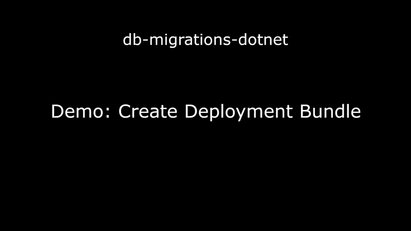
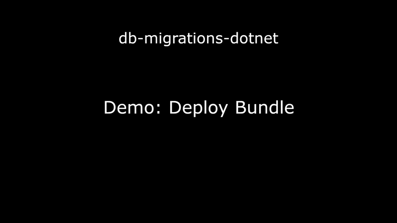

# db-migrations-dotnet Demo

## Project setup

The following clip demonstrates setting up a brand new project that will be utilizing a single PostgreSQL database:

- Create new directory for project
- Initialize [swig-cli](https://github.com/mikey-t/swig) dev task orchestration tool for project
- Verify swig is working
- Add `docker-compose.yml` file - PostgreSQL is used for this example
- Add `.env` file with credentials for DB access
- Update `swigfile.ts` to re-export methods for the DockerCompose module from the referenced npm package [swig-cli-modules](https://github.com/mikey-t/swig-cli-modules)
- Run new swig task `dockerUp` to start PostgreSQL docker container
- Use vscode PostgreSQL extension to connect to newly running database
- Update `swigfile.ts` to:
  - Re-export methods for the EntityFramework module from the referenced npm package [swig-cli-modules](https://github.com/mikey-t/swig-cli-modules)
  - Add config for the single local PostgreSQL database that this project will be managing
- Run newly available swig task `dbBootstrapMigrationsProject` which will generate a C# project
- Copy `.env` to the newly generated C# migrations project
- Run the swig task `dbSetup` which will create users and databases defined in our `swigfile.ts`
- Use vscode PostgreSQL extension to verify that database was created

*Length: 60 seconds*

See [./GettingStarted.md](./GettingStarted.md) for detailed instructions.

## Add Initial Migration

The following clip demonstrates creating an initial empty migration that we can later use to easily migrate our database back to it's initial state if we need to by using the migration name "Initial":

- Run: `swig dbAddMigration Initial`
- Show migration in it's "pending" state by running the "list" command: `swig dbListMigrations`
- Show boilerplate EF C# files and empty "up" and "down" sql script placeholder files
- Apply migrations: `swig dbMigrate`
- Show that migration is applied by running `swig dbListMigrations` again (no "pending" status)

*Length: 42 seconds*

## Add Example Migration

The following clip demonstrates creating a migration for a table called "Person" and applies the migration to the database:

- Create migration called "Person" with command: `swig dbAddMigration Person`
- Paste "up" and "down" sql into the files automatically generated by previous script (you can generate these using [pgAdmin](https://www.pgadmin.org/), or another PostgreSQL UI app, or craft the sql manually)
- Change vscode language detection from generic "sql" to "postgres"
- Apply migrations with command: `swig dbMigrate`
- Show that new table exists in database

*Length: 35 seconds*

## Remove Migration

The following clip demonstrates removing the migration from the previous example:

- Run "list" command so we know the name of the migration just before the one we want to remove: `swig dbListMigrations`
- Migrate to the "Initial" migration: `swig dbMigrate Initial`
- Refresh database view to show that the "down" script was executed and the table no longer exists
- Run "list" command again to see that the "Person" migration is now back to the "pending" state
- Remove or "pop" the most recent migration, which is only possible now that it's in the "pending" state: `swig dbRemoveMigration`
- Note the message stating that non-empty sql files were not deleted
- Manually delete `Person.sql` and `Person_Down.sql` (assuming we don't need this migration anymore)

*Length: 42 seconds*

## Generate EF Deployment Bundle

The following clip demonstrates creating a deployment bundle:

- Update config in `swigfile.ts` so it only generates a single `linux-x64` bundle, instead of the default of generating 2 bundles (`linux-x64` and `win-x64`)
- Run: `swig dbCreateRelease`
- Show the generated exe

*Length: 22 seconds*

## Deploy Using Generated EF Deployment Bundle

The following clip demonstrates deploying the Entity Framework bundle generated in the previous clip to a mock production database:

- Setup a mock production database (note that mock database setup is for demo purposes only - normally this would be setup in your deployment environment by some other means):
  - Create a directory `acme-prod-mock`
  - Copy `docker-compose.yml` as-is to the new directory
  - Copy `.env` to the new directory and change the port from `5432` to `5431` so both databases can be running at the same time
  - Add some demo-only snippets to `swigfile.ts` to interact with the mock production database
  - Start the new containerized database
  - Run `docker container ls` to show that both containers are now running and available on different ports
  - Register new database instance in vscode postgresql extension using alternate port so we can later visually see when the migrations have been applied
  - Login to the container
  - Run psql commands to create new empty `dbmigrationsexample` database and user role
  - Show in vscode postgresql extension that the new instance has the `dbmigrationsexample` database
- Copy files into the mock production container's `/tmp` directory:
  - EF bundle: `./release/MigrateMainDbContext-linux-x64.exe`
  - `./.env` (using the root version with port `5432` since that's the container-internal port)
- From shell within container's `/tmp` directory, execute EF bundle: `./MigrateMainDbContext-linux-x64.exe`
- Show in vscode postgresql extension that mock production database has had our database migrations applied

*Length: 90 seconds*

> ℹ️ Alternatively, if you're on a windows machine that has access to the target database and would like to deploy directly from your own local machine instead of copying the bundle to the target server:
> - Generate an EF bundle that targets windows instead of linux by adding `win-x64` to `releaseRuntimeIds` array in your `swigfile.ts` config
> - Add a `.env` file to the release directory next to the generated bundle executable
> - Execute the bundle file
